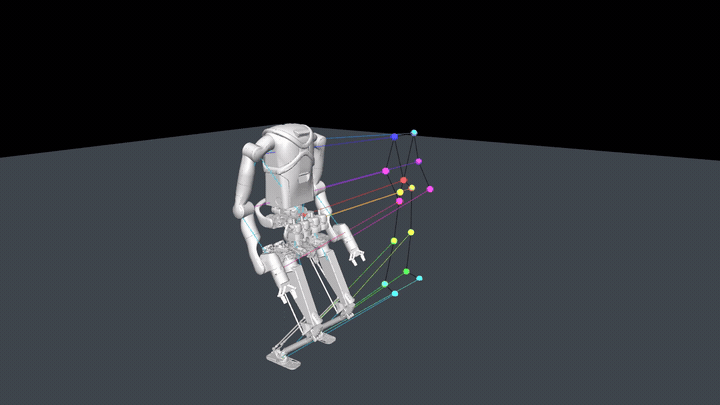
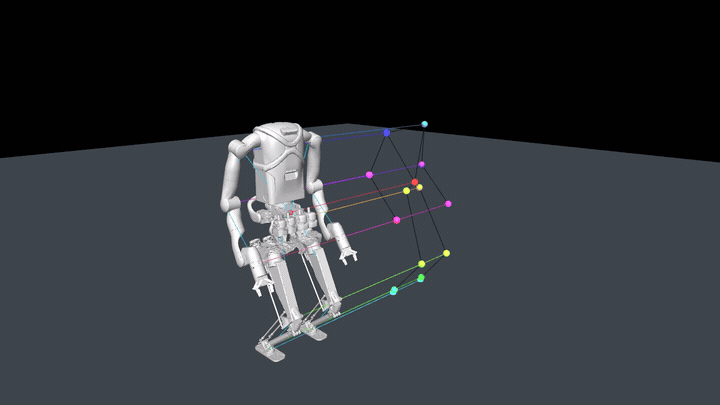
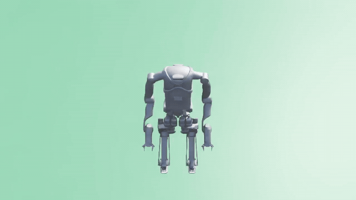

# Kangaroo Retargeting for MuJoCo and IsaacLab

Retargeting semantischer SOMA23-Keypoints auf den Kangaroo-Roboter mit
geschlossenen Beinmechanismen. Dieses Repository enthält den eigenen
Kangaroo-Code, XML und Meshes, eine konfigurierte USD sowie die vollständige
XML→USD-Pipeline.

ProtoMotions selbst wird nicht versioniert. `setup_upstream.sh` klont den
getesteten Upstream-Stand lokal nach `.vendor/ProtoMotions` und kopiert das
Kangaroo-Overlay hinein.

## MuJoCo

### Mapping vor der Optimierung



### Optimiertes Retargeting



## IsaacLab

### Exportierte Kangaroo-Motion



## Enthaltene Roboterdateien

```text
overlay/protomotions/data/assets/Kangaroo/kangaroo_grippers_ias.xml
overlay/protomotions/data/assets/Kangaroo/usd/kangaroo_grippers_ias/
    kangaroo_grippers_ias_configured.usd
overlay/data/assets/                 # referenzierte STL-Meshes
```

Die XML ist die physikalische MuJoCo-Quelle. Die konfigurierte USD enthält 28
Aktuator-Drives, 32 initiale Gelenkzustände und zwei sphärische
Loop-Constraints für PhysX.

## Installation

Voraussetzungen:

- Conda-Umgebung `env_isaaclab` mit Python 3.11;
- Isaac Sim und IsaacLab 2.3.x;
- MuJoCo, SciPy, NumPy, PyTorch, Typer und tqdm;
- FFmpeg und Git LFS.

```bash
git lfs install
conda activate env_isaaclab
chmod +x setup_upstream.sh commands.sh
./setup_upstream.sh
```

ProtoMotions ist auf Commit
`b93d29ce731812af7d0ab29c744fa1396e26a8f9` gepinnt.

## Pipeline

```text
SOMA23-Keypoints (.npy)
        |
        v
MuJoCo-Retargeting (.npz)
        |
        +--> MuJoCo-Viewer und MP4
        |
        v
ProtoMotions-Motion (.motion)
        |
        +--> IsaacLab-Viewer und MP4
        |
        v
Mimic-Training
```

Die lokale Beispieldatei wird unter folgendem Pfad erwartet:

```text
sample_data/230213_no_speak_001__A185_keypoints.npy
```

Sie ist durch `.gitignore` ausgeschlossen, bis die Lizenz des Quelldatensatzes
für eine Veröffentlichung geprüft wurde.

## Einzelschritte

### 1. XML direkt in MuJoCo prüfen

```bash
./commands.sh model
```

### 2. Semantisches Mapping ohne Optimierung prüfen

```bash
./commands.sh mapping
```

### 3. Gesamten Clip optimieren

```bash
./commands.sh retarget
```

Ausgabe:

```text
output/retargeted/230213_no_speak_001__A185_retargeted.npz
```

### 4. Optimierung in MuJoCo ansehen

```bash
./commands.sh view
```

### 5. MuJoCo-Videos rendern

```bash
./commands.sh mujoco-videos
```

### 6. XML in USD konvertieren

```bash
./commands.sh usd
```

Der Befehl führt zwei Schritte aus:

1. `convert_kangaroo_ias.py` importiert die MJCF/XML mit Isaac Labs
   `MjcfConverter` nach USD.
2. `configure_kangaroo_ias_usd.py` übernimmt Initialpose und Aktuatoren aus
   dem MJCF, ersetzt die beiden importierten Loop-Joints durch sphärische
   PhysX-Joints, setzt genau eine Articulation Root und blendet die sichtbaren
   Kollisionshilfen aus.

Die endgültige USD wird zurück in das eigene Repository kopiert:

```text
overlay/protomotions/data/assets/Kangaroo/usd/kangaroo_grippers_ias/
    kangaroo_grippers_ias_configured.usd
```

### 7. USD mit PhysX testen

```bash
./commands.sh usd-test
```

### 8. Retargeting in `.motion` konvertieren

```bash
./commands.sh convert
```

### 9. Motion in IsaacLab ansehen

```bash
./commands.sh isaaclab
```

### 10. IsaacLab-Video aufnehmen

```bash
./commands.sh isaac-video
```

### 11. MP4s in GitHub-GIFs konvertieren

```bash
./commands.sh gifs
```

## Kommandoübersicht

```bash
./commands.sh help
```

| Kommando | Funktion |
|---|---|
| `sync` | eigenes Overlay erneut in ProtoMotions kopieren |
| `model` | Kangaroo-XML in MuJoCo laden |
| `mapping` | Mapping vor der Optimierung anzeigen |
| `retarget` | vollständigen Clip optimieren |
| `view` | Retargeting in MuJoCo anzeigen |
| `mujoco-videos` | MuJoCo-MP4s rendern |
| `usd` | XML importieren und konfigurierte USD erzeugen |
| `usd-test` | USD in IsaacLab/PhysX testen |
| `convert` | NPZ nach ProtoMotions `.motion` konvertieren |
| `isaaclab` | Motion in IsaacLab anzeigen |
| `isaac-video` | IsaacLab-MP4 aufnehmen |
| `gifs` | MP4s in README-GIFs umwandeln |

## Relevante Skripte

```text
overlay/data/scripts/retarget_soma_keypoints_to_kangaroo.py
overlay/data/scripts/convert_pyroki_retargeted_robot_motions_to_proto.py
overlay/examples/load_kangaroo_xml_mujoco.py
overlay/examples/visualize_kangaroo_mapping_setup_mujoco.py
overlay/examples/visualize_kangaroo_retarget_mapping_mujoco.py
overlay/examples/render_kangaroo_retarget_videos_mujoco.py
overlay/examples/visualize_kangaroo_ias_isaaclab.py
overlay/examples/motion_libs_visualizer.py
overlay/usd_convert/convert_kangaroo_ias.py
overlay/usd_convert/configure_kangaroo_ias_usd.py
```

## Eigenes GitHub-Repository anlegen

```bash
cd /home/nico/Documents/KangarooRetargeting
git lfs install
git add .
git status
git commit -m "Initial Kangaroo retargeting pipeline"
```

Der lokale Ordner ist bereits als Git-Repository auf Branch `main`
initialisiert. Daher ist hier kein weiteres `git init` erforderlich.

Danach auf GitHub ein leeres Repository anlegen:

```bash
git remote add origin git@github.com:DEIN-NAME/KangarooRetargeting.git
git push -u origin main
```

Vor `git add .` unbedingt [`ASSET_LICENSES.md`](ASSET_LICENSES.md) prüfen.
